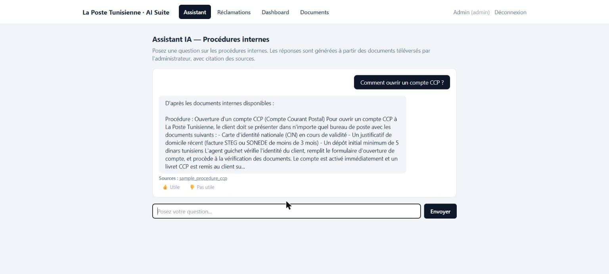
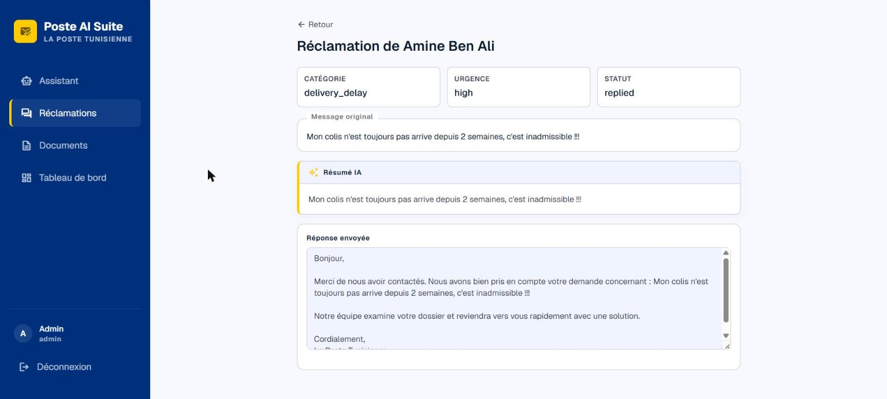
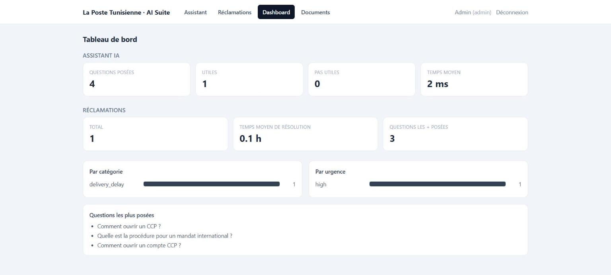
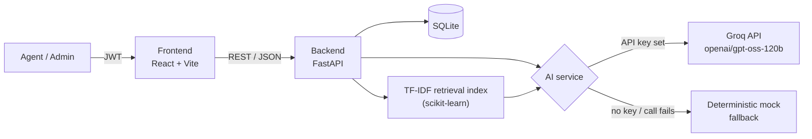

# La Poste Tunisienne — AI Suite


Developed by **Ayham Ksouri** and **Yassine Jouini**.

Two AI modules on one platform, built for La Poste Tunisienne:

- 🤖 **Assistant IA (RAG)** — employees ask questions about internal procedures in natural language; the system retrieves the relevant document chunks and generates a grounded answer with source citations, or honestly says it doesn't know.
- 📮 **Triage des réclamations** — agents paste a raw customer complaint; the system classifies it, rates urgency, summarizes it, and drafts a reply — a human always reviews and approves before anything is sent.

<p align="center">
  
  
  
</p>

A full write-up with more detail (architecture, AI design decisions, screenshots) lives in [`docs/rapport-avancement.html`](docs/rapport-avancement.html). For a technical orientation (request flow, mock-fallback contract, migrations, Docker), see [`ARCHITECTURE.md`](ARCHITECTURE.md).

## How it's built



The AI service is the single point every generated answer flows through: it always tries a real Groq API call first, and transparently falls back to rule-based mock logic if no key is configured or the call fails — nothing else in the app needs to know the difference.

## AI design highlights

- **Structured outputs** — complaint classification uses Groq's strict JSON-schema output (`response_format: {type: "json_schema", strict: true}`, on `openai/gpt-oss-120b`), so category/urgency/summary/draft come back as guaranteed-valid JSON, no fragile parsing.
- **Conversation memory** — the frontend sends the full conversation with every question, so follow-ups and conversational replies ("merci" after an answer) are understood in context instead of evaluated in isolation.
- **Anti-hallucination guard** — RAG retrieval has a minimum relevance threshold; below it, the assistant says it doesn't know instead of guessing.
- **Prompt-injection safety** — every system prompt explicitly tells the model to treat complaint text and retrieved document chunks as data to analyze, never as instructions to follow.
- **Never breaks** — no API key, a failed call, or a model refusal all fall back to deterministic mock responses automatically. The app is always demoable, online or offline.
- **Human-in-the-loop** — AI drafts are never sent automatically; `draft_reply` (AI) and `final_reply` (what the agent actually sent) are stored separately for full traceability.

## Deviations from the original spec

Made for a fast local setup with no extra installs:

| Spec said | This uses | Why |
|---|---|---|
| PostgreSQL | SQLite | Zero install; same SQLAlchemy models, swap the connection string later if you want Postgres |
| ChromaDB (embedding vector store) | scikit-learn TF-IDF + cosine similarity | ChromaDB's `hnswlib` dependency needs a C++ compiler not installed on this machine; TF-IDF needs no compiler and works well for procedure-document retrieval |

Docker Compose and Alembic migrations, both originally listed as deviations, have since been added — see [`ARCHITECTURE.md`](ARCHITECTURE.md) for how the dev-oriented `docker-compose.yml` and the migration workflow actually work.

Everything else (auth, schema, endpoints, prompt-injection-safe AI prompts) matches the spec.

## Requirements

- Python 3.12+, Node.js 18+ (both already installed if you're reading this after the initial setup)
- Optional: a Groq API key (free, from [console.groq.com](https://console.groq.com/keys)), for real AI responses instead of mocked ones

## Setup

### Backend

```powershell
cd backend
python -m venv venv
.\venv\Scripts\Activate.ps1
pip install -r requirements.txt
copy .env.example .env
# edit .env and set GROQ_API_KEY if you have one
uvicorn app.main:app --reload
```

Backend runs at http://127.0.0.1:8000. On first run it creates `data/poste.db` (SQLite) and seeds an admin account: `admin@poste.tn` / `admin123` (change `ADMIN_EMAIL`/`ADMIN_PASSWORD` in `.env` before a real deployment).

Without `GROQ_API_KEY` set, the app runs entirely on deterministic mock AI responses — every endpoint still works end-to-end for a demo, just without real AI-generated text.

### Frontend

```powershell
cd frontend
npm install
npm run dev
```

Frontend runs at http://localhost:5173 and proxies `/api/*` to the backend.

## Demo flow

1. Log in as `admin@poste.tn` / `admin123`.
2. **Documents** (admin) — upload a procedure document (PDF/DOCX/TXT).
3. **Assistant** — ask a question about that document, see the cited answer, rate it.
4. **Réclamations** — submit a sample complaint, watch it get triaged instantly, review/edit the draft reply, send it.
5. **Dashboard** (admin) — see live stats from both modules.

## Tech stack

| Layer | Technology |
|---|---|
| Backend | Python 3.12 · FastAPI |
| Data | SQLAlchemy 2.0 · SQLite |
| Auth | PyJWT · passlib/bcrypt |
| RAG retrieval | scikit-learn (TF-IDF + cosine similarity) |
| Text extraction | pypdf · python-docx |
| AI | Groq API (`openai/gpt-oss-120b`) via the official `groq` Python SDK |
| Frontend | React 18 · Vite · React Router · Tailwind CSS |
| Versioning | Git |

## Project structure

```
backend/
  app/
    main.py           FastAPI app, CORS, startup seeding
    config.py          env-based settings
    db.py / models.py  SQLAlchemy engine + schema
    auth.py             JWT auth, password hashing
    schemas.py          Pydantic request/response models
    routers/
      auth.py           /auth/register, /auth/login, /auth/me
      rag.py             /rag/documents, /rag/ask, /rag/stats, ...
      complaints.py       /complaints, /complaints/stats, ...
    services/
      ai_client.py       Groq API calls + mock fallback
      documents.py        PDF/DOCX text extraction + chunking
      vectorstore.py      TF-IDF retrieval index
frontend/
  src/
    api/client.js        fetch wrapper with JWT handling
    AuthContext.jsx        auth state
    pages/                Login, Assistant, Complaints, ComplaintDetail, Dashboard, AdminDocuments
```

## Notes for your defense / report

- **Prompt-injection safety**: both AI calls treat user-supplied text (complaint text, retrieved document chunks) as data, never as instructions — see the system prompts in `services/ai_client.py`.
- **"I don't know" handling**: the RAG retrieval has a similarity floor (`MIN_RELEVANCE` in `vectorstore.py`) — if nothing relevant is found, the assistant says so instead of guessing.
- **Audit trail**: every login, document upload/delete, question asked, and complaint action is recorded in the `audit_log` table.
- **Draft vs. final reply**: complaints store both `draft_reply` (AI-generated) and `final_reply` (what the agent actually sent) separately, so you can show "AI suggested X, agent sent Y" if asked.

## Roadmap

1. **Enable live AI** — set `GROQ_API_KEY` in `backend/.env` and restart; no code changes needed.
2. **Automated tests** — cover auth, classification, and retrieval endpoints.
3. **Production database** — optional migration to PostgreSQL + Docker Compose for multi-user deployment.
4. **Semantic retrieval** — optional swap of TF-IDF for embedding-based search if match quality needs to improve.
5. **Deployment** — host backend and frontend for access outside the local machine.

## Authors

- **Ayham Ksouri**
- **Yassine Jouini**
